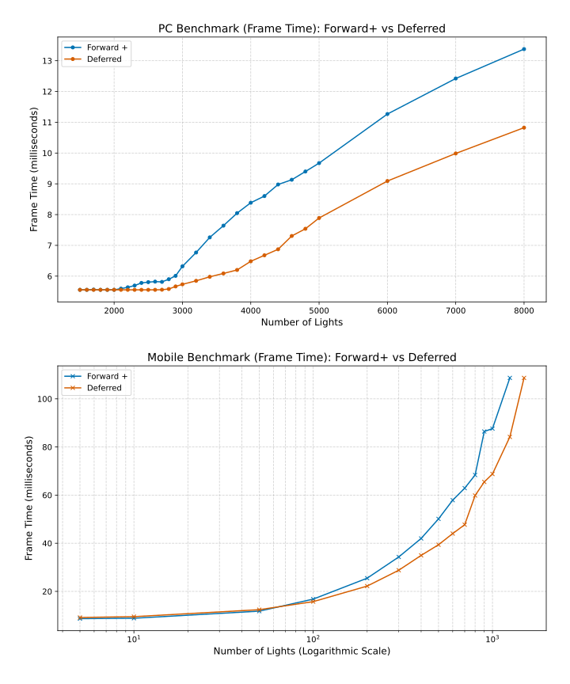
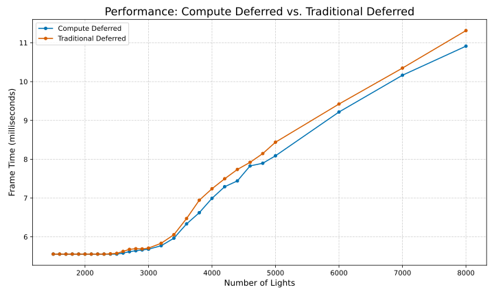

WebGL Forward+ and Clustered Deferred Shading
======================

## [Live Demo](https://tsingloo.github.io/WebGPU-Project4-Forward-Plus-and-Clustered-Deferred/)

* **University of Pennsylvania, CIS 565: GPU Programming and Architecture, Project 4**
    * Xiaonan Pan
      * [LinkedIn](https://www.linkedin.com/in/xiaonan-pan-9b0b0b1a7), [My Blog](www.tsingloo.com), [GitHub](https://github.com/TsingLoo)
    * Tested on: 
      
      | Component\Platform | PC                                              | Mobile                                                       |
      | ------------------ | ----------------------------------------------- | ------------------------------------------------------------ |
      | OS                 | Google Chrome(141.0.7390.108) @ Windows 11 24H2 | Google Chrome(141.0.7390.111) @ Android 14                   |
      | CPU/SoC            | Intel 13600KF @ 3.5Ghz                          | [MediaTek Dimensity 8100](https://www.mediatek.com/products/smartphones/mediatek-dimensity-8100) |
      | GPU                | 4070 SUPER 12GB                                 | Arm Mali-G610 MC6                                            |
      | RAM                | 32GB RAM                                        | 12GB RAM                                                     |
      | Model              |                                                 | Redmi K50                                                    |

### Demo Video/GIF

https://github.com/user-attachments/assets/7da29776-83ef-4660-9702-f51ed1dad99b

# Features 

## Z-Prepass

A Z-Prepass is implemented in this project because the scene contains many overlapping objects. This initial rendering pass processes only the scene’s geometry to generate the depth buffer. A minimal vertex shader transforms the vertices, while a simple fragment shader discards transparent fragments based on the alpha channel. During the main shading pass, only fragments with depth values equal to those recorded in the Z-Prepass are processed.

## Clustered & Light Culling

To efficiently manage numerous light sources, a clustered light culling approach is used. The view frustum is spatially divided into a 3D grid of smaller volumes called clusters. A compute shader determines which lights intersect each cluster’s volume. During the actual lighting pass, each fragment determines the cluster it belongs to and retrieves the list of lights that contribute to that cluster. The subsequent lighting calculations are then performed based on this information.

### A Single Global Buffer Instead of Per-Cluster Buffers

My implementation uses a single global buffer to store the indices of potentially visible lights. Each cluster stores only two values: an offset into this global buffer and a count indicating how many light indices belong to it. **This approach is more memory-efficient because it avoids allocating many separate per-tile or per-cluster lists in different memory regions**.

However, there is a hardware-imposed limitation: ` the maximum storage buffer binding size is 134217728`. In practice, this means **the global buffer approach cannot always store significantly more light indices than a per-tile buffer**. For example, if the cluster grid resolution is 32 × 32 × 32 and each cluster tracks up to 1024 lights, the total buffer size will exceed the binding limit. As a result, when a scene contains thousands of lights, this implementation may lose track of some light-cluster associations, producing visible tiled artifacts or lighting discontinuities as the image below.

### Logarithmic Z-Slicing

To improve the effectiveness of clustered light culling across varying depths, the view frustum’s Z-axis is sliced logarithmically rather than linearly in view space. When calculating a fragment’s cluster Z-index, its view-space Z coordinate is transformed using a logarithmic function. The implementation is based on [A Primer On Efficient Rendering Algorithms & Clustered Shading](https://www.aortiz.me/2018/12/21/CG.html).

## Forward + 

A Forward+ rendering pipeline **performs light culling before the main shading pass**. It consists of three main stages: the Z-prepass, light culling, and the shading pass. This approach retains the simplicity of a single main shading pass while enabling efficient per-fragment lighting. It is also more flexible than classic deferred rendering, as it naturally supports transparency and multiple material models within a single pass. 

## Deferred Rendering by Single Compute Pass

In deferred rendering, the scene is first "rendered" using a simple vertex and fragment shader that output essential surface information—such as albedo, position, and normal into multiple render targets known as G-buffers. A subsequent pass then performs the light culling and actual lighting calculations using these G-buffer textures. By separating geometry rendering from lighting, deferred rendering decouples lights from scene complexity—lighting is computed only per pixel, rather than per object. This makes it highly efficient when dealing with many light sources. 

In my implementation, a compute shader replaces the traditional fragment shading stage. Instead of relying on the fixed-function rasterization pipeline, the compute shader dispatches one thread per screen pixel, combining the vertex and fragment stages into a single programmable step.

The full pipeline includes the following stages: the Z-prepass, G-buffer pass, light culling, compute shading pass and final blit pass to display the rendered image.

# Performance Analysis

## Benchmark Setup

All test results are obtained with the cluster dimensions configured as **x = 16, y = 16, z = 16**, and a **maximum of 1024 lights per cluster**, rendering at a fixed resolution of **1080p**.

A benchmark script automatically varies the number of active lights in the scene and measures performance by counting how many frames are rendered within a given time period.

## Mobile & PC 

The PC benchmark results performed as expected, initially demonstrating the clear advantage of powerful desktop hardware and high memory bandwidth. In the early stage, both Forward+ and Deferred rendering were so efficient they were simply limited by the 180 FPS cap. However, the distinction emerged as Forward+ began to degrade first at 2100 lights, indicating it hit a compute bottleneck as its fragment shader complexity scaled with the light count. Deferred rendering sustained peak performance until 2700 lights. 

Contrary to the common assumption that **deferred rendering** is problematic for mobile platforms due to bandwidth constraints, the benchmark results indicate **a performance advantage over Forward+ rendering in scenarios with high light counts**. While the deferred approach exhibited a minor initial overhead with fewer than 100 lights, its performance scaled more effectively as the scene complexity increased.

## Deferred Rendering by Single Compute Pass (Extra Credit)

Both deferred rendering methods exhibit identical performance at lower light counts and when the light count exceeds 2,400, a consistent performance gap appears. The **Compute Deferred approach maintains a lower frame time compared to the Traditional Deferred** method, and this gap widens as the number of lights scales up. 

The performance advantage comes from the compute shader’s ability to skip the GPU’s fixed-function rasterization stage and run directly on compute units. Instead of running per-pixel like fragment shaders, compute shaders work in small groups allowing threads to share and reuse lighting data efficiently using fast shared memory. This reduces unnecessary global memory access and lowers overall bandwidth usage.

# Credits

- [A Primer On Efficient Rendering Algorithms & Clustered Shading.](https://www.aortiz.me/2018/12/21/CG.html)
- [Vite](https://vitejs.dev/)
- [loaders.gl](https://loaders.gl/)
- [dat.GUI](https://github.com/dataarts/dat.gui)
- [stats.js](https://github.com/mrdoob/stats.js)
- [wgpu-matrix](https://github.com/greggman/wgpu-matrix)
