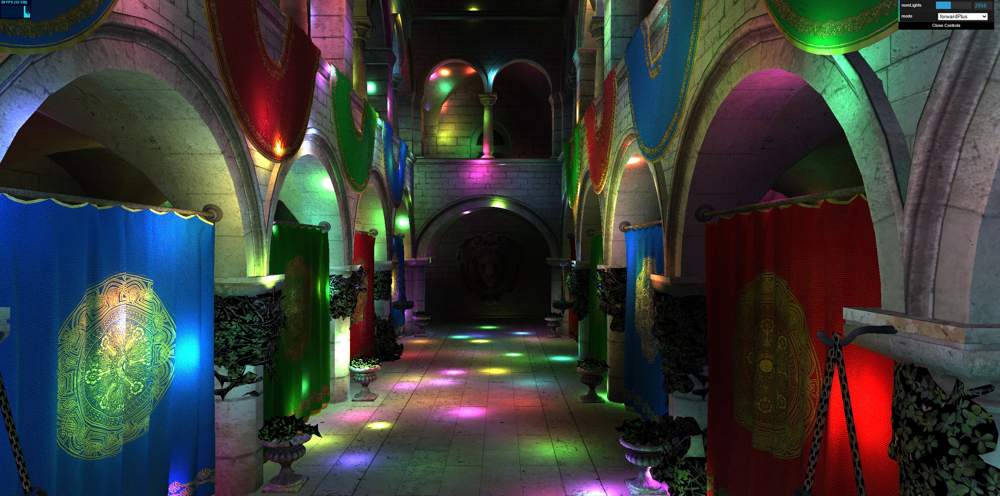

WebGL Forward+ and Clustered Deferred Shading
======================

**[Live Demo](https://tsingloo.github.io/WebGPU-Project4-Forward-Plus-and-Clustered-Deferred/)**

* **University of Pennsylvania, CIS 565: GPU Programming and Architecture, Project 4**
    * Xiaonan Pan
      * [LinkedIn](https://www.linkedin.com/in/xiaonan-pan-9b0b0b1a7), [My Blog](www.tsingloo.com), [GitHub](https://github.com/TsingLoo)
    * Tested on: 
      * Windows 11 24H2
      * 13600KF @ 3.5Ghz
      * 4070 SUPER 12GB
      * 32GB RAM

### Demo Video/GIF

### (TODO: Your README)

*DO NOT* leave the README to the last minute! It is a crucial part of the
project, and we will not be able to grade you without a good README.

This assignment has a considerable amount of performance analysis compared
to implementation work. Complete the implementation early to leave time!

### Credits

- [Vite](https://vitejs.dev/)
- [loaders.gl](https://loaders.gl/)
- [dat.GUI](https://github.com/dataarts/dat.gui)
- [stats.js](https://github.com/mrdoob/stats.js)
- [wgpu-matrix](https://github.com/greggman/wgpu-matrix)
